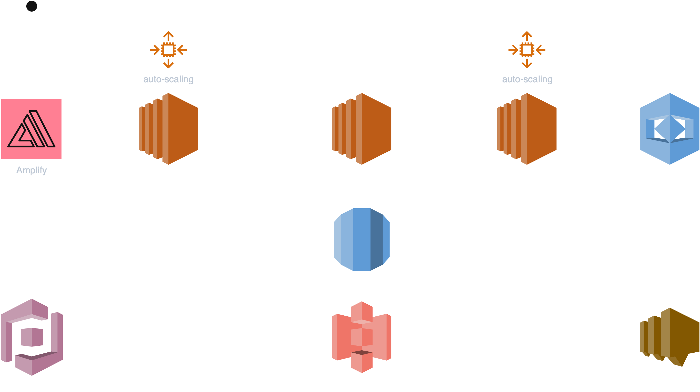

# WingSight

A web application that allows to parse live CCTV streams with the specified frequency and 
get email notifications on appearance of specified objects in provided video streams. Currently, as a proof of concept, 
the application is limited to the domain of bird nest watch and provides notifications on detected bird species. 
The app is deployed into AWS infrastructure with Terraform. Underlying stack is Django + RabbitMQ + OpenCV + ffmpeg + Rekognition,
which allows to extend the app to the domain of CCTV streams handling RTSP protocol. The app is designed with scalability in mind 
which makes is applicable for higher computational loads.

## Deployment

After a successful `terraform apply`, note the `amplify_app_url` output. To complete the Amplify setup:

1. Log in to the AWS Amplify console at:
```
https://us-east-1.console.aws.amazon.com/amplify/apps
```
2. Select your Wingsight app.
3. If prompted by a popup, click **Remind me later**.
4. Choose the Git branch you deployed (match your `repo_branch_name`).
5. Click **Run job** to trigger the frontend build and deployment.

## Terraform Variables

### Terraform CLI Variables

Provide these variables when running `terraform plan`, `apply`, or `destroy`:

- `aws_region` — AWS region for provisioning (e.g. `us-east-1`).
- `key_name` — EC2 key pair name for SSH access.
- `db_username` — Username for the RDS database.
- `db_password` — Password for the RDS database.
- `rabbitmq_user` — Username for RabbitMQ.
- `rabbitmq_password` — Password for RabbitMQ.
- `github_username` — GitHub account owning the code repository.
- `github_token` — GitHub personal access token with repo permissions.
- `img_bucket_name` — S3 bucket name for thumbnails (same as above).
- `repo_branch_name` — Git branch to deploy and reference in outputs.

### Amplify Deployment Variables

These control the AWS Amplify frontend setup (set in `terraform.tfvars` or via CLI):

- `github_repository` — URL of the frontend code repository.
- `repo_branch_name` — Branch name for deployment (same as above).
- `amplify_app_name` — Name for the Amplify application.
- `amplify_domain_name` (optional) — Custom domain for the frontend.

## Repository Structure

```text
.
├── README.md
├── amplify.yml
├── .github/workflows/main.yml # CI/CD pipeline for Terraform
├── src/
│ ├── wingsight-frontend/ # React front-end
│ ├── wingsight-rabbitmq/ # RabbitMQ setup and scripts
│ ├── wingsight-server/ # Django back-end and stream handler
│ └── wingsight-stream_processor/ # Stream processor and Rekognition
└── terraform/ # Terraform IaC modules and state backend
├── installation_scripts/ # Templates for EC2 user_data scripts
└── *.tf # AWS service definitions
```

## Application Architecture Discussion
The design of the app  architecture is primarily driven by two objectives. On the one hand, the service is processing live video streams, 
so it was essential to separate the stream processing logic from the instances that are responsible for the user interaction, 
while allowing for the scalability of computationally expensive stream parsing. On the other hand, 
it is important to avoid vendor lock-in and complicated debugging. In order to achieve this, the decision was made
to utilize the commonly used patterns such as authentication middleware for secure user interaction instead of 
integrating with AWS services entirely.

In the architecture diagram below, the example of the data flow in the system is provided for the case when a user adds 
a new video stream. First, the user authenticates with Cognito. After the successful authentication, 
Amplify frontend application stores the authentication token. This token is included in the auth header with each request to the backend. 
Then, when the user requests to add a new stream, Amplify app sends this request to the EC2 Django Web Server. Upon receiving the request, 
web server’s auth middleware parses the authentication token, and makes a request to the Cognito User Pool to ensure 
the user is authenticated and authorized to make such requests. After successfully authorizing the request, our web server 
does two things. First, it inserts a database entry for the new stream subscription, which is handled by RDS. 
Then, the web server puts a new queue entry that includes database stream id into EC2 RabbitMQ Message Broker. 
When the new queue entry is created, the third compute instance, EC2 Stream Watcher, consumes the queue entry with the 
database stream id, retrieves the data from RDS, and starts parsing the stream in a separate thread using ThreadPoolExecutor. 
This particular design is chosen to allow for asynchronous consumption of new streams in the case when AWS adds more 
EC2 Stream Watcher instances during auto-scaling. The design with message broker allows to ensure only one stream parser 
will be assigned to each new stream.

During the stream parsing in the EC2 Stream Watcher, before parsing every next frame, it fetches the most recent record 
from the database about the stream that is being parsed. It checks if the stream is still active (in the case if the user 
deactivated the subscription or deleted the stream in-between the frame fetch period), and then proceeds to retrieve a 
frame using the combination of two libraries. It uses yt-dlp shell utility through Python subprocess to fetch the url 
for raw stream, and then OpenCV library to compose the actual frame from the incoming stream data. After the frame is composed, 
it interacts with the AWS Rekognition to retrieve the detected objects. If relevant objects were detected (in this case, bird species), 
EC2 StreamWatcher then creates the thumbnail for the frame in which objects were detected, and then puts it into AWS S3. 
Then it creates a database entry with the recognition entry and the link to the thumbnail stored in S3, and then uses AWS SNS 
to invoke a user notification using the user's email which is also retrieved from the database. 
After this process the user is able to see the new entry in the recognition history in the frontend UI. 
The thumbnails are retrieved by Amplify using the S3 presigned url with expiration time which is generated on 
EC2 Django Web Server during the serialization process invoked by the user's request to see recognition history 
for a particular stream.


