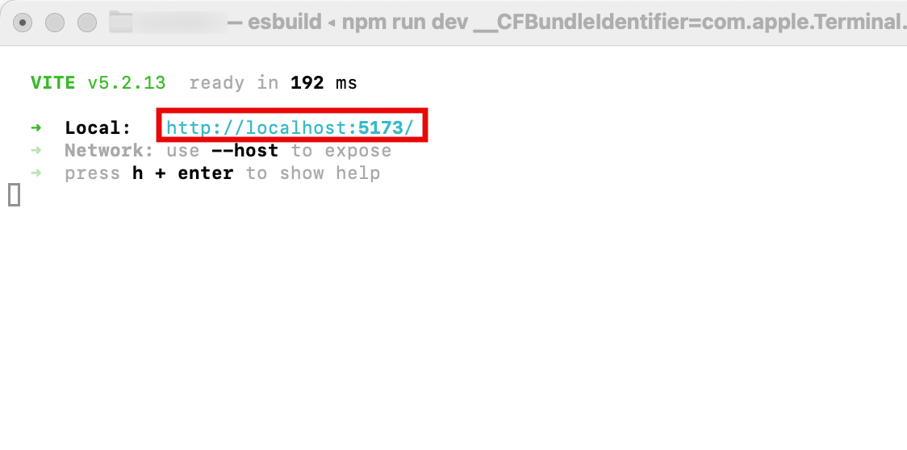

# WingSight Frontend (Amplify)

## Development Setup

*Make sure you have Node.js and npm installed first.*

Navigate to the `/wingsight` directory and install the dependencies.

```
cd src/wingsight-frontend/wingsight
npm install
```

<br>

Run the development server and open the Local link to view the application in your browser.

```
npm run dev
```



<br>

Create a file called `.env` at the root of the Amplify project (`/src/wingsight-frontend/wingsight/`). Define environment variables for your local environment. See the section on [local Cognito resources](#creating-local-cognito-resources) for details on creating required resources.
```
touch .env

#.env
# API base URL (no endpoints)
VITE_WINGSIGHT_API_URL = 'http://localhost:XXXX/api-url/'

# ID of Cognito User Pool
USER_POOL_ID = 'aws-region_xxxx'

# ID of Cognito Identity Pool
IDENTITY_POOL_ID = 'aws-region:xxxx'

# ARN of the Authenticated access Role 
AUTH_ROLE_ARN = 'arn:aws:iam::AWS-ACCOUNT-ID:role/service-role/auth-role'

# ARN of the Guest access Role
UNAUTH_ROLE_ARN = 'arn:aws:iam::AWS-ACCOUNT-ID:role/service-role/unauth-role'

# ID of the User Pool App Client
USER_POOL_CLIENT_ID = 'xxxx'
```

Test modifications to backend resources (anything in the `amplify` folder) in an isolated local environment with
[Amplify Cloud Sandbox](https://docs.amplify.aws/react/deploy-and-host/sandbox-environments/setup/) so that changes do not go directly to deployed branches.

```
# run with local environment variables
npx dotenvx run --env-file=.env -- ampx sandbox
```

After a successful deployment, the output file `amplify_outputs.json` is generated. 
*This file is required for backend details such as authentication and storage to function.*

*`amplify_outputs.json` can also be downloaded from a deployed version of the app in the AWS Amplify Console at `<app-name> -> <branch-name> -> Deployments -> Deployed backend resources`.*

Delete the sandbox environment when development is finished.
```
npx dotenvx run --env-file=.env -- ampx sandbox delete
```

---

## Creating Local Cognito Resources

1. User Pool: A user directory that manages user accounts, authentication, and authorization.
    - Options for sign-in identifiers: Email
    - Required attributes for sign-up: email and preferred_username

2. App Client: A configuration within a User Pool that defines the specific settings and permissions for an application to interact with the User Pool.
    - Application Type: Single-page Application
    - Application Name: Pick a name

3. Auth Role: An IAM role that defines the permissions for authenticated users when accessing AWS resources through an Identity Pool.
    - Permission Policy:
    ```
    {
        "Version": "2012-10-17",
        "Statement": [
            {
                "Effect": "Allow",
                "Action": [
                    "cognito-identity:GetCredentialsForIdentity"
                ],
                "Resource": "IDENTITY-POOL_ARN"
            },
            {
                "Effect": "Allow",
                "Action": [
                    "cognito-sync:*"
                ],
                "Resource": "IDENTITY-POOL_ARN"
            }
        ]
    }
    ```
    - Trust Policy:
    ```
    {
        "Version": "2012-10-17",
        "Statement": [
            {
                "Effect": "Allow",
                "Principal": {
                    "Federated": "cognito-identity.amazonaws.com"
                },
                "Action": "sts:AssumeRoleWithWebIdentity",
                "Condition": {
                    "StringEquals": {
                        "cognito-identity.amazonaws.com:aud": "IDENTITY-POOL-ID"
                    },
                    "ForAnyValue:StringLike": {
                        "cognito-identity.amazonaws.com:amr": "authenticated"
                    }
                }
            }
        ]
    }
    ```

4. Guest Role: An IAM role that defines the permissions for unauthenticated (guest) users when accessing AWS resources through an Identity Pool.
    - Permission Policy:
    ```
    {
        "Version": "2012-10-17",
        "Statement": [
            {
                "Effect": "Allow",
                "Action": [
                    "cognito-identity:GetCredentialsForIdentity"
                ],
                "Resource": "IDENTITY-POOL-ARN",
                "Condition": {
                    "StringEquals": {
                        "cognito-identity.amazonaws.com:amr": "unauthenticated"
                    }
                }
            }
        ]
    }
    ```
    - Trust Policy:
    ```
    {
        "Version": "2012-10-17",
        "Statement": [
            {
                "Effect": "Allow",
                "Principal": {
                    "Federated": "cognito-identity.amazonaws.com"
                },
                "Action": "sts:AssumeRoleWithWebIdentity",
                "Condition": {
                    "StringEquals": {
                        "cognito-identity.amazonaws.com:aud": "IDENTITY-POOL-ID"
                    },
                    "ForAnyValue:StringLike": {
                        "cognito-identity.amazonaws.com:amr": "unauthenticated"
                    }
                }
            }
        ]
    }
    ```

5. Identity Pool: A service that provides temporary AWS credentials to users, allowing them to access other AWS services securely.
    - Authenticated and Guest access (source: Cognito user pool)
    - Authenticated Role: Use Auth Role made above
    - Guest Role: Use Guest Role made above
    - User Pool Id: ID from User Pool
    - Client App Id: ID from User Pool's Client App
    - Identity Pool Name: pick a name

## Amplify Console Deployment (Manual)

1. In the Amplify Console, click the `Create new app` button.
2. Select `GitHub` as the Git provider. You may need to authenticate your GitHub account before continuing.
3. Under `Select a repository`, select `SWEN-614-Spring-2025/term-project-team2-the-tweet-team`. If it does not appear, you may need to press the `Update GitHub permissions` to allow Amplify access to the repository (this should already be done). 
4. Select the branch that you wish to use as the production branch. This branch must include the frontend files and the `amplify.yml` file.
5. Under `App name`, give an appropriate name for the app. Amplify should automatically detect the frontend build command and the build output directory.
6. Click `Save and Deploy` to create the app.

---

## Troubleshooting

### Sandbox Issues

If the sandbox does not deploy succesfully, bootstrapping may be required.

1. Make sure you have AWS Cloud Development Kit (CDK) installed. Make sure
your `PATH` environment variable includes the global npm directory.
```
npm install -g aws-cdk

# find the directory for global npm packages
npm config get prefix
```

2. Create an Amplify-specific IAM user with the `AdministratorAccess-Amplify` and `AmplifyBackendDeployFullAccess` policies. You may also need the following 
additional permissions in a custom policy for bootstrapping to work: 
```
{
    "Version": "2012-10-17",
    "Statement": [
        {
            "Sid": "Bootstrapping",
            "Effect": "Allow",
            "Action": [
                "cloudformation:*",
                "ecr:*",
                "ssm:*"
            ],
            "Resource": "*"
        }
    ]
}
```

3. Configure this user with your environment of choice.

```
aws configure --profile <AMPLIFY_USER>
export AWS_PROFILE=<AMPLIFY_USER>
```

4. Bootstrap your AWS account and region to prepare it for Amplify.

```
cdk bootstrap aws://<AWS_ACCOUNT_ID>/<AWS_REGION>
```

Once the bootstrap is successful, re-run the sandbox deployment.

---

### Manual Amplify Console Deployment Issues

Check the build log for the app under `<app-name> -> <branch-name> -> Build`. It the app failed to deploy, the error message will be here.

The most common issue is that Amplify does not have permission to access the resources it needs to generate the backend files. If this is the case:

1. Create a new IAM Role that has Amplify has a trusted entity. For policies, include `AmplifyBackendDeployFullAccess` and a custom inline policy with the following permissions. Fill in `<aws-region>` and `<aws-account-id>` with your desired AWS region and your AWS account id.
```json
{
    "Version": "2012-10-17",
    "Statement": [
        {
            "Sid": "PushLogs",
            "Effect": "Allow",
            "Action": [
                "logs:CreateLogStream",
                "logs:PutLogEvents"
            ],
            "Resource": "arn:aws:logs:<aws-region>:<aws-account-id>:log-group:/aws/amplify/*:log-stream:*"
        },
        {
            "Sid": "CreateLogGroup",
            "Effect": "Allow",
            "Action": "logs:CreateLogGroup",
            "Resource": "arn:aws:logs:<aws-region>:<aws-account-id>:log-group:/aws/amplify/*"
        },
        {
            "Sid": "DescribeLogGroups",
            "Effect": "Allow",
            "Action": "logs:DescribeLogGroups",
            "Resource": "arn:aws:logs:<aws-region>:<aws-account-id>:log-group:*"
        }
    ]
}
```
2. Back in the Amplify Console, go to `<app-name> -> App Settings` and Edit the Service role to be the IAM Role you just created. Upon saving, you may have to manually redeploy any affected branches.